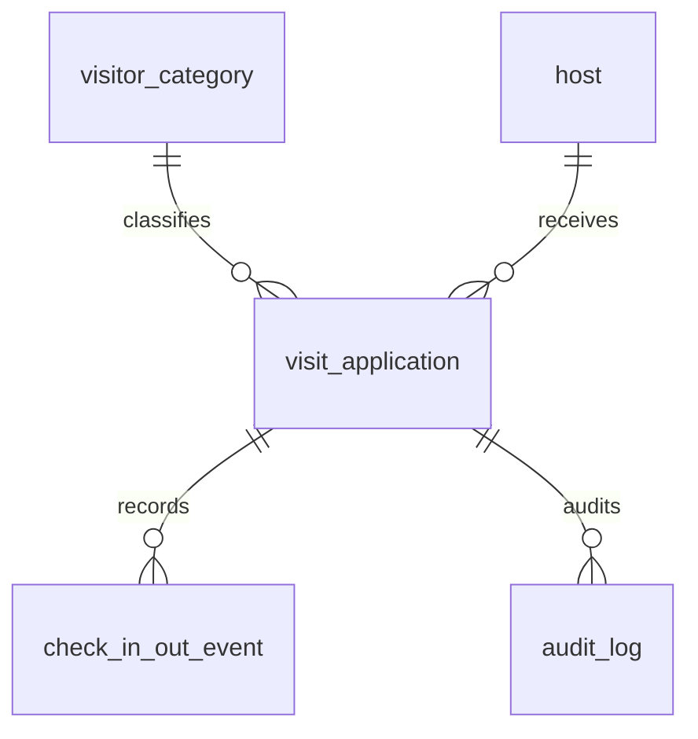

# Database ERD

```mermaid
erDiagram
  visitor_category ||--o{ visit_application : classifies
  host ||--o{ visit_application : receives
  visit_application ||--o{ check_in_out_event : records
  visit_application ||--o{ audit_log : audits
```
